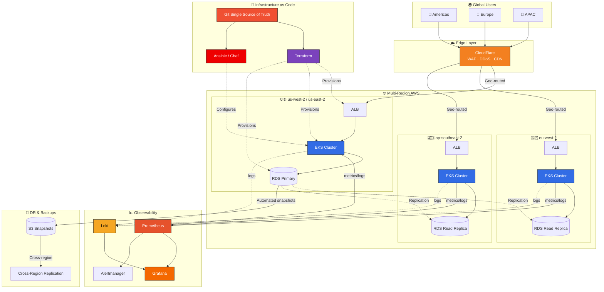

<!-- ======================= HERO BANNER ======================= -->

  

---

## 👨‍💻 About Me

Site Reliability Engineer / DevOps with **11+ years** of hands-on experience operating and automating high-load, mission-critical infrastructure at scale.

- 🏗️ **Infrastructure at scale:** 100,000+ VPS · 10,000+ dedicated servers · multi-region AWS
- 🔐 **Background in Information Security** (Zaporizhzhia National Technical University)
- ⚡ **Focus areas:** high-load systems, automation, cost optimization, secure network architecture
- 🌍 **Based in Ukraine**

---

## 🎯 Key Achievements

| Area | Impact |
| --- | --- |
| 🛡️ **Reliability** | Designed fault-tolerant infrastructure supporting 99.9%+ uptime across multi-region deployments |
| ⚙️ **Automation** | Codified infrastructure with Terraform + Ansible/Chef, cutting manual provisioning from hours to minutes |
| 📈 **Scale** | Operated fleets of 100k+ VPS and 10k+ dedicated servers under continuous load |
| 💰 **Cost optimization** | AWS spend reduction through right-sizing, spot instances, and reserved capacity planning |
| 🔒 **Security** | Hardened network perimeters, IAM policies, secrets management, and compliance controls |

---

## 📈 Career Timeline

  

---

## 🛠️ Tech Stack

<table>
<tr>
  <td valign="top" width="33%">

**☁️ Cloud & Infrastructure**

  </td>
  <td valign="top" width="33%">

**🔧 Infrastructure as Code**

  </td>
  <td valign="top" width="33%">

**📦 Containers & Orchestration**

  </td>
</tr>
<tr>
  <td valign="top">

**🐧 Operating Systems**

  </td>
  <td valign="top">

**🚀 CI/CD & Automation**

  </td>
  <td valign="top">

**📊 Observability & Storage**

  </td>
</tr>
<tr>
  <td valign="top">

**🌐 Networking & VPN Protocols**

  </td>
  <td valign="top">

**💻 Scripting & Tools**

  </td>
  <td valign="top">

**🔐 Security**

  </td>
</tr>
<tr>
  <td valign="top" colspan="3">

**🧑‍💻 Application Runtimes I Operate in Production**

  </td>
</tr>
</table>

---

## 🏗️ Infrastructure Architecture (v2)

**Design principles I follow:**
- 🔁 **Multi-region by default** — active-active where possible, active-passive with DNS failover where required
- 💾 **Immutable backups** — automated snapshots + cross-region replication + periodic restore drills
- 📜 **Git as single source of truth** — every production change goes through a reviewed commit
- 📊 **SLO-driven operations** — error budgets, burn-rate alerts, post-mortems for every incident

---

## ⚡ Daily Workflow

  

---

## 🐍 Contribution Activity

  <picture>
    <source media="(prefers-color-scheme: dark)" srcset="https://raw.githubusercontent.com/marchenkovit/marchenkovit/output/github-contribution-grid-snake-dark.svg" />
    <source media="(prefers-color-scheme: light)" srcset="https://raw.githubusercontent.com/marchenkovit/marchenkovit/output/github-contribution-grid-snake.svg" />
    
  </picture>

