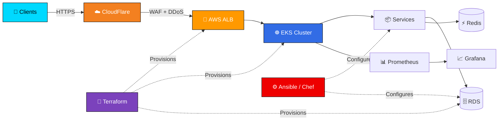

---

### About Me

- 11+ years in server administration, virtualization, and infrastructure automation
- Experience with large-scale environments (100,000+ VPS, 10,000+ dedicated servers)
- Focused on high-load systems, AWS automation, and secure network architecture
- Education: Zaporizhzhia National Technical University — Information Security

---

### Daily Workflow

  

---

### Tech Stack

---

### Infrastructure I Build

---

### Contribution Activity

  <picture>
    <source media="(prefers-color-scheme: dark)" srcset="https://raw.githubusercontent.com/marchenkovit/marchenkovit/output/github-contribution-grid-snake-dark.svg" />
    <source media="(prefers-color-scheme: light)" srcset="https://raw.githubusercontent.com/marchenkovit/marchenkovit/output/github-contribution-grid-snake.svg" />
    
  </picture>

---

### Contacts

