  

<a class="cpill" style="background:#D14836" href="mailto:marchenko.vitaliy1@gmail.com">✉ marchenko.vitaliy1@gmail.com</a>
<a class="cpill cpill-light" style="background:#2CA5E0" href="https://t.me/m_a_r_c_h_e_n_k_o">✈ @m_a_r_c_h_e_n_k_o</a>
📍 Ukraine
<a class="cpill" style="background:#b91c1c" href="{{ site.github.repository_url }}/blob/main/LICENSE">© All Rights Reserved</a>

---

## 👨‍💻 About Me

Site Reliability Engineer / DevOps with **11+ years** of hands-on experience operating and automating high-load, mission-critical infrastructure at scale.

- 🏗️ **Infrastructure at scale:** 100,000+ VPS · 10,000+ dedicated servers · multi-region AWS
- 🔐 **Background in Information Security** (Zaporizhzhia National Technical University)
- ⚡ **Focus areas:** high-load systems, automation, cost optimization, secure network architecture
- 🌍 **Based in Ukraine**

---

## 🎯 Key Achievements

| Area | Impact |
| --- | --- |
| 🛡️ **Reliability** | Designed fault-tolerant infrastructure supporting 99.9%+ uptime across multi-region deployments |
| ⚙️ **Automation** | Codified infrastructure with Terraform + Ansible/Chef, cutting manual provisioning from hours to minutes |
| 📈 **Scale** | Operated fleets of 100k+ VPS and 10k+ dedicated servers under continuous load |
| 💰 **Cost optimization** | AWS spend reduction through right-sizing, spot instances, and reserved capacity planning |
| 🔒 **Security** | Hardened network perimeters, IAM policies, secrets management, and compliance controls |

---

## 📈 Career Timeline

  

---

## 🎯 Recent Engagements

**Softhousegroup**
*SRE / DevOps · 2024 – present*

- CI/CD pipelines for production releases
- Docker · Kubernetes orchestration
- ELK Stack + Graylog observability
- Provisioning and hardening of dedicated servers

**S-Pro**
*Unix System Administrator · 2019 – 2024*

- AWS Infrastructure-as-Code with Terraform
- CI/CD pipelines for development teams
- Performance tuning: Nginx, PHP-FPM, MySQL/MariaDB under high load
- VPN / SSL / IAM / security groups across cloud
- Built complete 4-floor (2,000 m²) office network on Cisco Meraki

**NTX**
*Unix System Administrator · 2018 – 2019*

- Administered VPS park of **20,000+** instances
- L1/L2 support for **1,200+** dedicated servers
- Virtualization via **KVM** and **OpenVZ**
- Network routing, firewalling, SSL, VPN
- Automated monitoring + backup systems

---

## 🛠️ Tech Stack

<h3>☁️ Cloud &amp; Infrastructure</h3>
AWSAmazon EKSHetznerCloudFlareDigitalOceanProxmox

<h3>🔧 Infrastructure as Code</h3>
TerraformAnsibleChef

<h3>📦 Containers &amp; Orchestration</h3>
DockerKubernetesHelm

<h3>🐧 Operating Systems</h3>
LinuxUbuntuDebianCentOSAlmaLinux

<h3>🚀 CI/CD &amp; Automation</h3>
GitLab CIGitHub ActionsJenkinsn8n

<h3>📊 Observability &amp; Storage</h3>
PrometheusGrafanaLokiZabbixELK StackGraylogMySQLMariaDBPostgreSQLRedis

<h3>🌐 Networking &amp; VPN</h3>
NginxHAProxyOpenVPNWireGuardIKEv2/IPsecstrongSwanL2TP/IPsecSoftEtherOpenConnectShadowsocksV2Ray/XrayTrojan-GFWSOCKS5

<h3>💻 Scripting &amp; Tools</h3>
BashPythonGit

<h3>🔐 Security</h3>
Fail2BaniptablesLet's Encrypt

<h3>🧑‍💻 Application Runtimes I Operate in Production</h3>
PHPLaravelNode.jsExpressPHP-FPMHeadless ChromiumTwilioMailgunAWS SES

---

## 📜 Certifications

🐧 Linux System Administration

<strong>ITEA Academy</strong> · 01 Jul 2023

Score 100/100

<a href="./assets/certs/itea-linux-system-administration.pdf">Verify № 4020425002 →</a>

⚙️ DevOps

<strong>ITEA Academy</strong> · 12 Dec 2023

Score 87/100

<a href="./assets/certs/itea-devops.pdf">Verify № 4010324007 →</a>

---

## 🏗️ Infrastructure Architecture

  

**Design principles I follow:**

- 🔁 **Multi-region by default** — active-active where possible, active-passive with DNS failover where required
- 💾 **Immutable backups** — automated snapshots + cross-region replication + periodic restore drills
- 📜 **Git as single source of truth** — every production change goes through a reviewed commit
- 📊 **SLO-driven operations** — error budgets, burn-rate alerts, post-mortems for every incident

---

## ⚡ Daily Workflow

  

---

## 🧰 Selected Work

**marchenko.work** — this site
*Themeless Jekyll on GitHub Pages*

- Zero render-blocking requests — no external stylesheet, no webfont, no framework
- All CSS inlined into the document; non-critical JS deferred via `requestIdleCallback`
- Explicit dimensions on every image, so the layout never shifts as artwork loads
- Hand-authored SVG graphics instead of third-party badge services
- CI builds the site and link-checks the built output before anything merges

<a class="pill" style="background:#181717" href="{{ site.github.repository_url }}">Source</a>

---

## 🐍 Contribution Activity

  <picture>
    <source media="(prefers-color-scheme: dark)" srcset="https://raw.githubusercontent.com/marchenkovit/marchenkovit/output/github-contribution-grid-snake-dark.svg" />
    <source media="(prefers-color-scheme: light)" srcset="https://raw.githubusercontent.com/marchenkovit/marchenkovit/output/github-contribution-grid-snake.svg" />
    
  </picture>

---

<blockquote class="markdown-alert-important" role="note" aria-label="Important">

<strong>© 2026 Vitalii Marchenko · All Rights Reserved</strong>

This repository is provided for <strong>viewing only</strong>. Forking, cloning, copying, modifying, or redistributing any content (source code, SVG graphics, README, configuration, or design) is <strong>strictly prohibited</strong> without prior written permission from the author.

Unauthorized use constitutes a violation of copyright law and will be pursued under applicable legal remedies. See <a href="{{ site.github.repository_url }}/blob/main/LICENSE">LICENSE</a> for full terms.

</blockquote>
